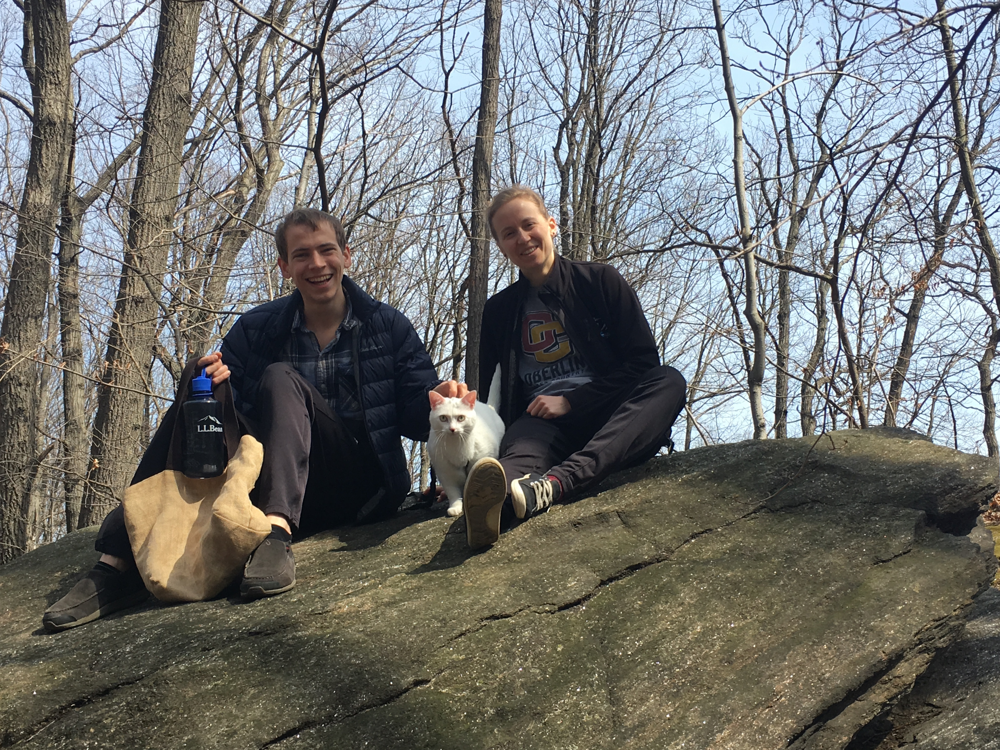

I am an MD/PhD student at Columbia University, and I currently work at the New York Genome Center in Dr. Tuuli Lappalainen's lab studying functional genomic variation. 

Learn more about me [here](about.html).

Learn more about the cat in the photo [here]().

