## General Attributes

Moon is a 3.5 year old American Shorthair. She was rescued from the ASPCA in the spring of 2017 after spending the first year of her life on the streets of NYC.

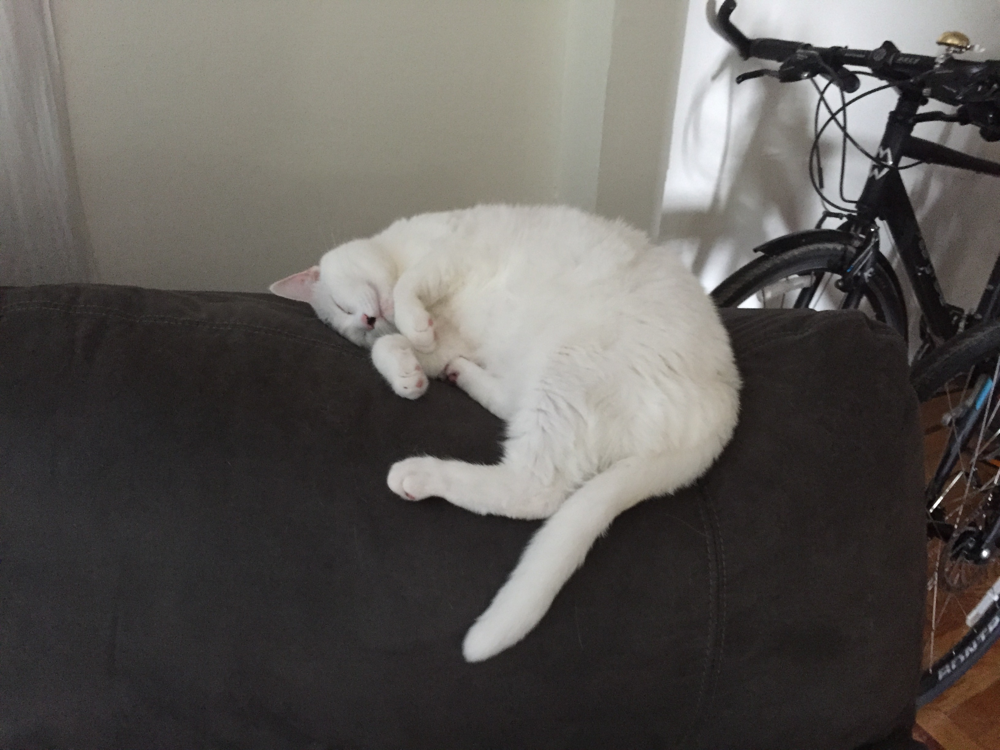

Moon is an exceptionally lazy cat, and unless she is heavily incentivized with freeze dried salmon treats (her obsession) playtime will consist of her half-heartedly batting at her bird from a lying down position and occasionally rolling over. 

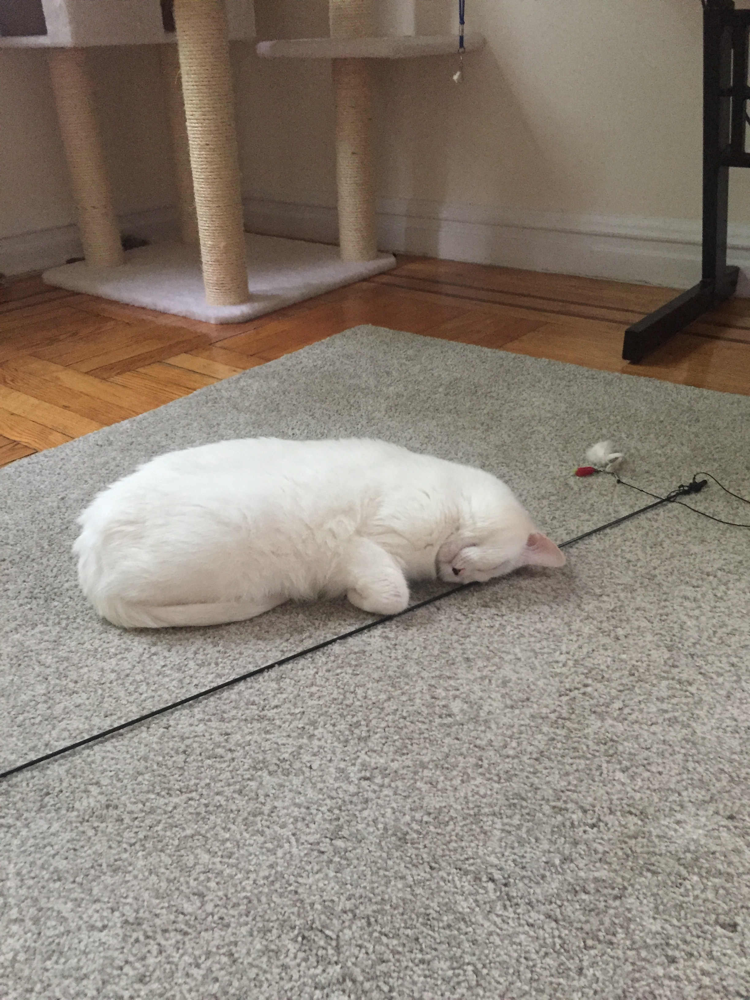

Since her rescue, Moon has become a bougie cat, and she refuses to be subjected to anything but life's finest comforts.

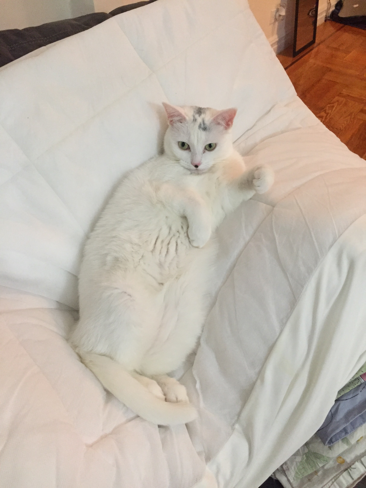

## Favorite Things

Her favorite things in the world are: 

* her tree, 

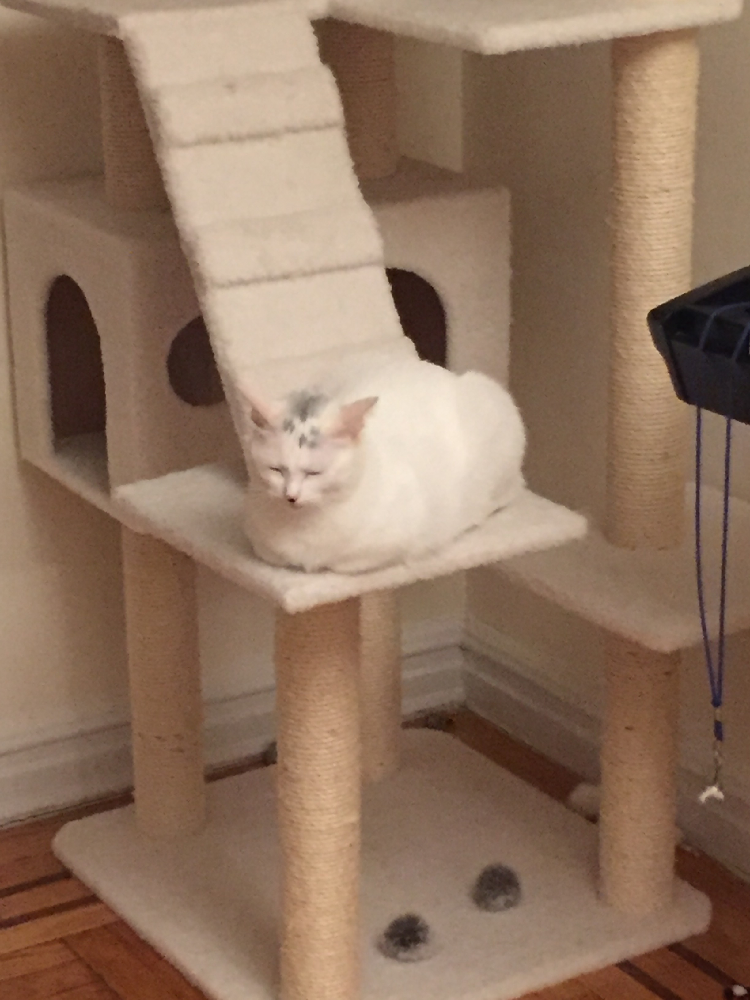

* her puff ball (unfortunately not featured in any photos), 
* her [ripple rug](https://www.amazon.com/SnugglyCat-Ripple-Rug-Interactive-Scratching/dp/B016H3T8EC), 

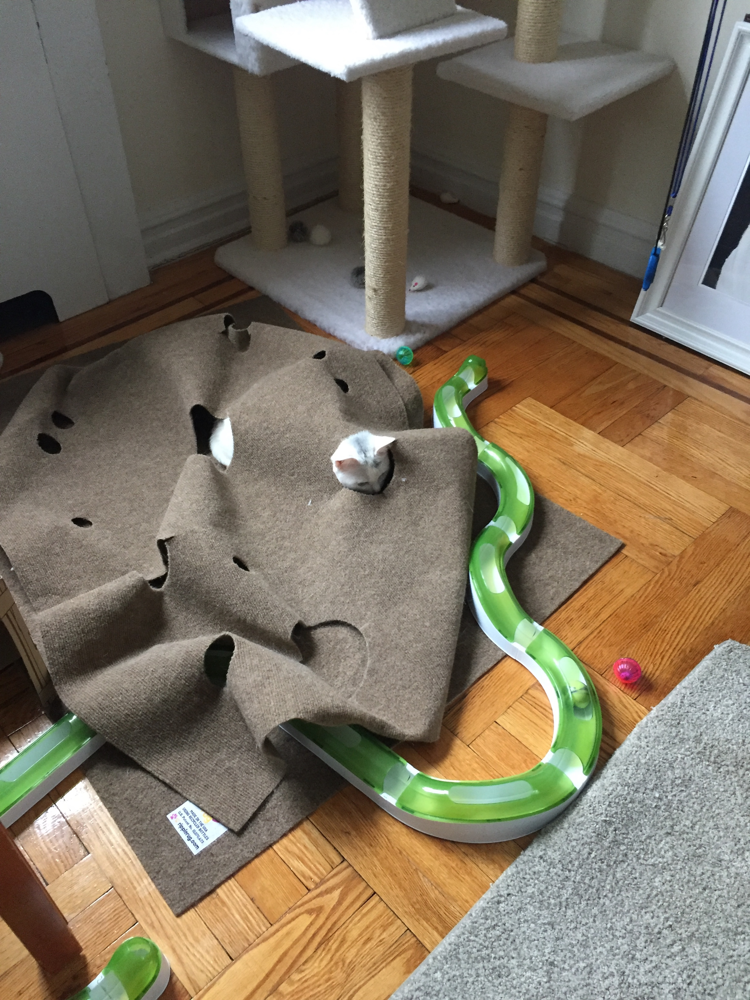

* salmon treats, 
* vegan walnut carrot cookies, 
* boxes, 

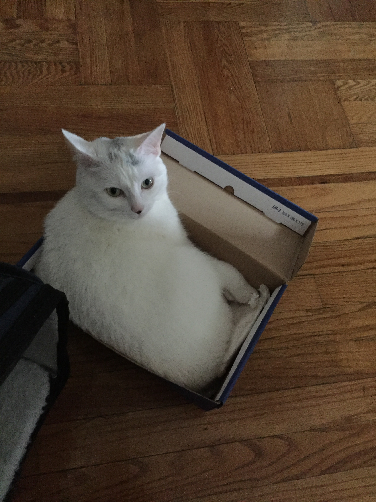

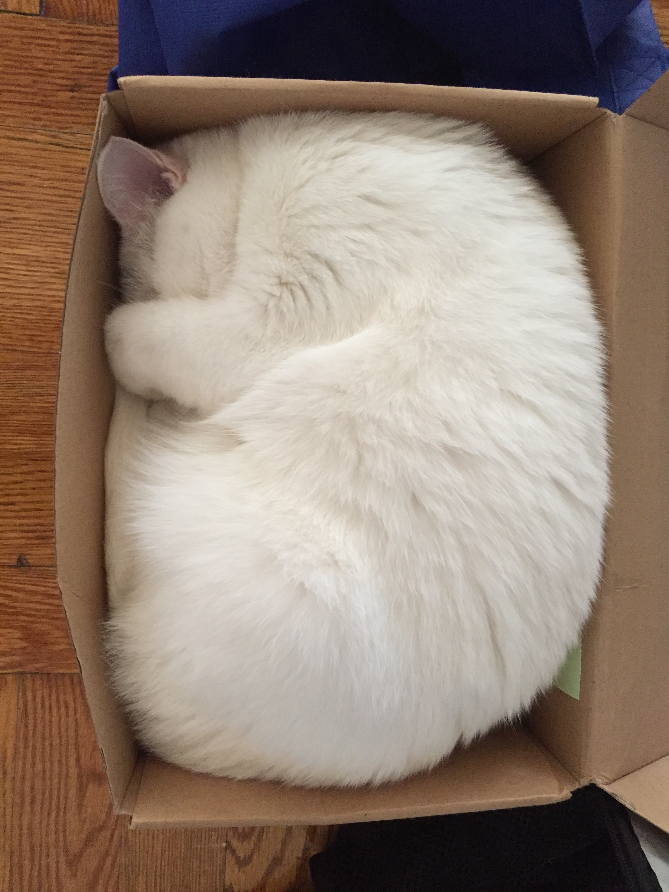

* sleeping, 

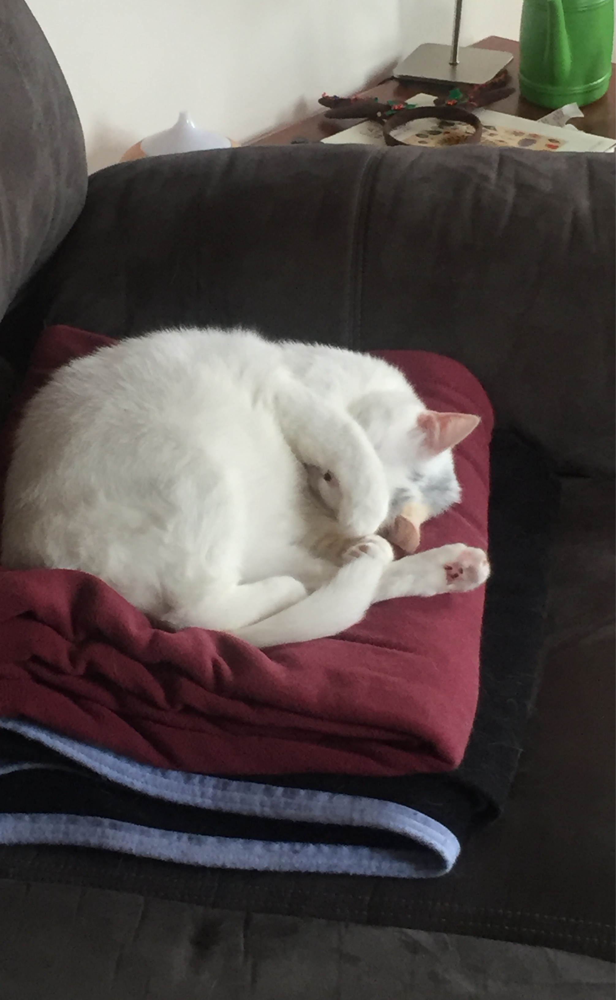

* collecting her toys like Dobby and sleeping with them,

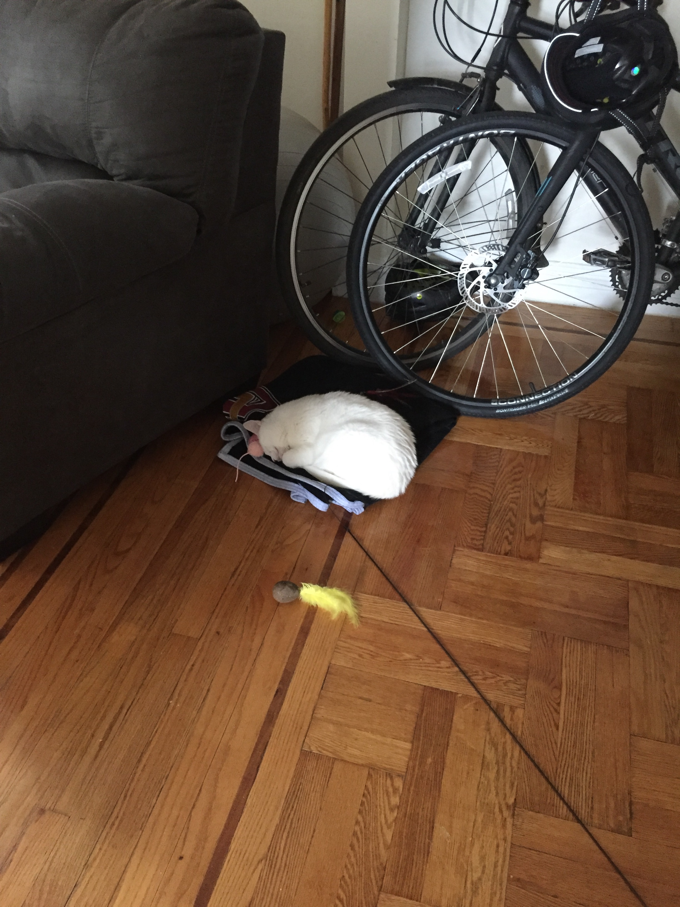

* and cuddles.

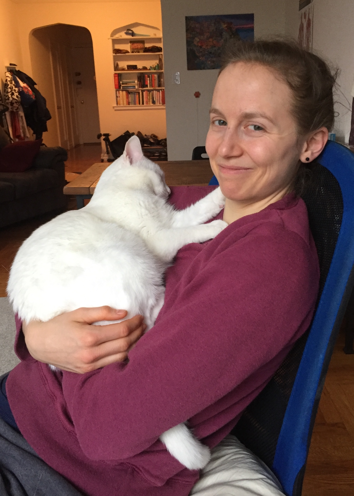

## Most Notable Accomplishment

Moon is featured in a work of art:

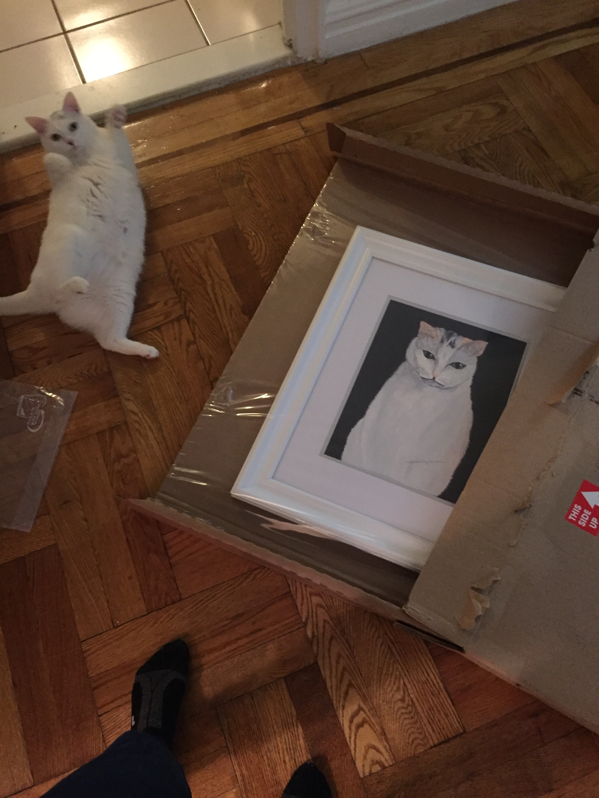
